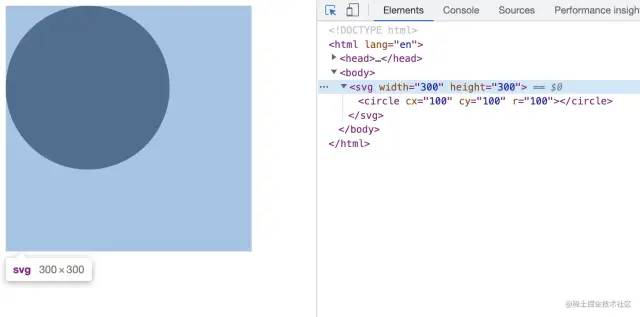
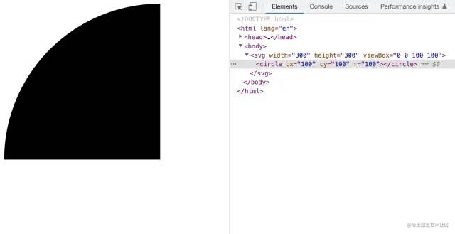
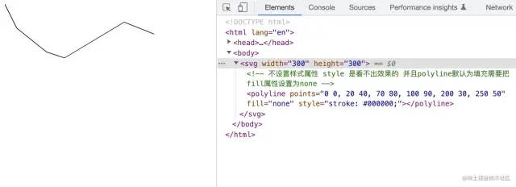
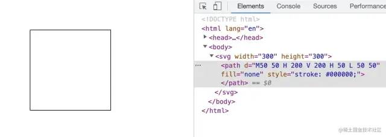
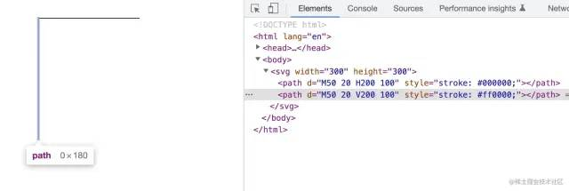
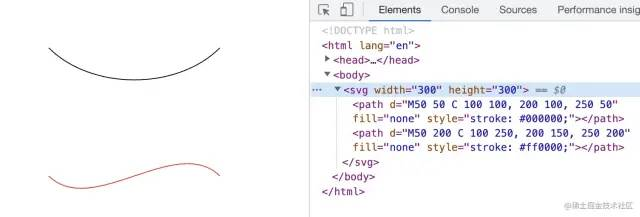
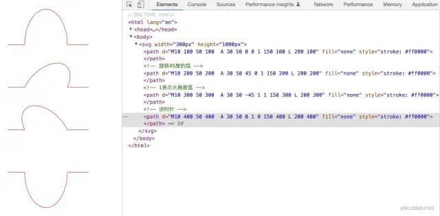
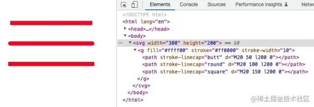
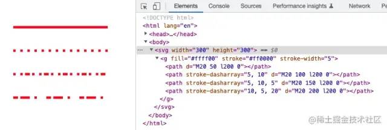

# 一文读懂 SVG

## 简介

SVG 是 `Scalable Vector Graphics` 的缩写，意为可缩放矢量图形。于 2003 年 1 月 14 日 SVG 1.1 被 Sun 公司（已被 Oracle 公司收购）、Adobe、苹果公司、IBM 以及柯达共同确立成为 W3C 推荐标准。

### 概念

那么 SVG 究竟是什么呢？

1. SVG 是一个基于文本的开放网络标准，用来定义用于网络的矢量图形
1. SVG 图像在放大或改变尺寸的情况下其图形质量不会有所损失，因此能够优雅而简洁地渲染不同大小的图形，并和 `CSS`，`DOM`，`JavaScript` 和 `SMIL` 等其他网络标准无缝衔接
1. SVG 使用 `XML` 格式定义图形
1. SVG 是万维网联盟的标准与诸如 `DOM` 和 `XSL` 之类的 W3C 标准是一个整体

### 优势

相对于其他格式的图像，SVG 的优势有很多：

1. SVG 与 `JPEG` 和 `GIF` 图像比起来，尺寸更小，且可压缩性更强。
1. SVG 图像中的文本是可选的，同时也是可搜索的，且可以与 `JavaScript` 技术一起运行
1. SVG 可在图像质量不下降的情况下被放大和缩小
1. SVG 可被非常多的工具读取和修改（比如文本编辑器）
1. SVG 图像不依赖分辨率，可在任何的分辨率下被高质量地打印
1. SVG 文件是纯粹的 `XML`
1. SVG 是开放的标准

### 缺点

1. SVG 复杂度越高渲染速度就会越慢（任何过度使用 `DOM` 的应用都不快）
1. SVG 不适合游戏应用，只能结合 `Canvas` 来实现
1. SVG 不能动态的修改动画内容

PS: 需要注意的是因为 `XML` 和 `HTML` 不同，`XML` 是区分大小写的，而 SVG 是使用 `XML` 格式来定义图形，所以在编写 SVG 的的时候元素和属性必须按标准格式书写。

## 语法

SVG 的语法如下：

```html
<svg>
	<circle cx="100" cy="100" r="50" />
</svg>
```

如上面的语法所示，SVG 的绘制其实就是一个 SVG 标签，然后在标签内绘制你要绘制的内容，比如上面的语法是在 SVG 标签中绘制了一个圆形(cx、cy 为圆的坐标，r 为圆的半径)。

代码如下：

```html
<!DOCTYPE html>
<html lang="en">
	<head>
		<meta charset="UTF-8" />
		<meta http-equiv="X-UA-Compatible" content="IE=edge" />
		<meta name="viewport" content="width=device-width, initial-scale=1.0" />
		<title>SVG - 语法</title>
	</head>
	<body>
		<svg>
			<circle cx="100" cy="100" r="50" />
		</svg>
	</body>
</html>
```

效果如下：


## 属性

`width`、`height` 设置用来设置 SVG 的宽高。

举个例子看一下：设置 SVG 的宽高为 `300 * 300`

效果如下：



注意：在不设置宽高的情况下，默认为 300 _ 150，当内部元素大于 300 _ 150 时，大于部分会被隐藏。

举个例子看一下：在坐标为（100， 100）的地方绘制一个半径为 100 的圆

```html
<!DOCTYPE html>
<html lang="en">
	<head>
		<meta charset="UTF-8" />
		<meta http-equiv="X-UA-Compatible" content="IE=edge" />
		<meta name="viewport" content="width=device-width, initial-scale=1.0" />
		<title>SVG - 属性</title>
	</head>
	<body>
		<svg>
			<circle cx="100" cy="100" r="100" />
		</svg>
	</body>
</html>
```

效果如下：


### viewBox

viewBox 属性定义了 SVG 中可以显示的区域。

语法：`viewBox="x y w h"` x、y 为起始点，w、h 为显示区域的宽高。

看字面意思，我觉得你肯定是会理解错的，举个例子看一下：

下面我们将在一个尺寸为 `300 * 300` 的 SVG 中绘制一个坐标为（`100, 100`）半径为 `100` 的圆，同时我们加上 `viewBox` 属性为`0 0 100 100`

```html
<!DOCTYPE html>
<html lang="en">
	<head>
		<meta charset="UTF-8" />
		<meta http-equiv="X-UA-Compatible" content="IE=edge" />
		<meta name="viewport" content="width=device-width, initial-scale=1.0" />
		<title>SVG - 属性</title>
	</head>
	<body>
		<svg width="300" height="300" viewBox="0 0 100 100">
			<circle cx="100" cy="100" r="100" />
		</svg>
	</body>
</html>
```

效果如下：



如图 SVG 里面的圆只显示了一部份，原因是 viewBox 定义了一个：从（0, 0）点开始，宽高为 100 _ 100 的显示区域。而这个 100 _ 100 的显示区域会放到 300 \* 300(svg 宽高)的 SVG 中去显示，整体就放大了 3 倍。

### version

version 属性用于指明 SVG 的版本，也就是指明 SVG 文档应该遵循的规范。version 属性纯粹就是一个说明，对渲染或处理没有任何影响。且目前只有 1.0 和 1.1 这两个版本。

示例：

```html
<svg version="1.1">// ...</svg>
```

下面是来自维基百科的一些版本信息：

#### 版本 1.x

-   SVG 1.0 于 2001 年 9 月 4 日成为 W3C 推荐标准。
-   SVG 1.1 于 2003 年 1 月 14 日成为 W3C 推荐标准。SVG 1.1 规范是模块化的，以便允许将子集定义为配置文件。除此之外，SVG 1.1 和 SVG 1.0 之间几乎没有区别。
-   SVG Tiny 和 SVG Basic（移动 SVG 配置文件）于 2003 年 1 月 14 日成为 W3C 推荐标准。这些被描述为 SVG 1.1 的配置文件。
-   SVG Tiny 1.2 于 2008 年 12 月 22 日成为 W3C 推荐标准。它最初是作为计划中的 SVG Full 1.2 的配置文件（后来被 SVG 2 放弃），但后来被重构为独立规范。它通常得不到很好的支持。
-   SVG 1.1 第二版，包括所有勘误表和说明，但在 2011 年 8 月 16 日发布的原始 SVG 1.1 没有新功能。
-   SVG Tiny 1.2 Portable/Secure，SVG Tiny 1.2 配置文件的更安全子集，于 2020 年 7 月 29 日作为 IETF 草案标准引入。也称为 SVG Tiny P/S。SVG Tiny 1.2 Portable/Secure 是 BIMI 草案标准的要求。

#### 版本 2

SVG 2 删除或弃用了 SVG 1.1 的一些特性，并结合了 HTML5 和 Web 开放字体格式的新特性：

-   例如，SVG 2 删除了几个字体元素，例如 `glyph` 和 `altGlyph`（由 WOFF 字体格式替换）。
-   不推荐使用该 `xml:space` 属性以支持 CSS。
-   添加了 HTML5 功能，例如 `translate` 和 `data-*`属性。
-   SVG Tiny 1.2 中的文本处理功能被注释为包含在内，但尚未在文本中正式化。其他一些 1.2 特性是精选的。但 SVG 2 通常不是 SVG tiny 1.2 的超集。
-   SVG 2 于 2016 年 9 月 15 日进入候选推荐阶段，修订版于 2018 年 8 月 7 日和 2018 年 10 月 4 日发布。最新草案于 2022 年 3 月 21 日发布。

### xmlns 和 xmlns:xlink

上面我们说过 SVG 使用 `XML` 格式定义图形，SVG 文件是纯粹的 `XML` 文件。

在 `XML` 中，标签和属性属于命名空间，这是为了防止来自不同技术的标签和属性发生冲突。例如在 SVG 中存在 `a` 标签，在 HTML 中也存在 `a` 标签，那么怎么区分这个 `a` 标签属于哪一种技术，这就需要使用命名空间了。加入命名空间以后我们就能知道哪一个是 `svg:a`，哪一个又是 `html:a`，这样我们就可以区分出不同的标签和属性。

`xmlns` 用于声明命名空间（`namespace`），在此声明之下的所有子标签都属于这个空间内。这里看起来是一个 `url`，但实际上仅仅是一个字符串，这样使用只是惯例。因此很多时候都会被称为”`namespace url`” 而不是”`namespace name`”。

当我们在 SVG 中加入 `xmlns` 时，因为它定义了默认命名空间，因此不需要前缀，我们直接在 SVG 标签中写一个 `a` 标签，`a` 标签和 UA 就知道它是 SVG 的 `a` 标签而不是 HTML 的 `a` 标签

`xmlns:xlink` 表示前缀为`xlink`的标签和属性，应该由理解该规范的 UA 使用`xlink`规范 来解释。

注解：UA 是`User Agent`的简称。`User Agent`是 Http 协议中的一部分，属于头域的组成部分。通俗地讲 UA 是一种向访问网站提供你所使用的浏览器类型、操作系统、浏览器内核等信息的标识。通过这个标识，用户所访问的网站可以显示不同的排版，从而为用户提供更好的体验或者进行信息统计。

示例：

```html
<svg xmlns="http://www.w3.org/2000/svg" xmlns:xlink="http://www.w3.org/1999/xlink">// ......</svg>
```

## 基本图形

基本图形其实就是我们插入到 SVG 标签中的元素，如上面示例中的圆形（`circle`）。

下面我们将依次介绍几个基本图形。

### 圆形（circle）

`circle` 标签能在屏幕上绘制一个圆形

语法：`<circle cx="100" cy="100" r="100"/>`

| 属性名 | 说明          |
| ------ | ------------- |
| cx     | 圆心的 X 坐标 |
| cy     | 圆心的 Y 坐标 |
| r      | 圆的半径      |

示例：

```html
<!DOCTYPE html>
<html lang="en">
	<head>
		<meta charset="UTF-8" />
		<meta http-equiv="X-UA-Compatible" content="IE=edge" />
		<meta name="viewport" content="width=device-width, initial-scale=1.0" />
		<title>SVG - 基本图形</title>
	</head>
	<body>
		<svg width="300" height="300">
			<circle cx="100" cy="100" r="100" />
		</svg>
	</body>
</html>
```


### 矩形（rect）

rect 标签能在屏幕上绘制一个矩形

语法：`<rect x="0" y="0" rx="5" ry="5" width="300" height="200"/>`

| 属性名 | 说明                |
| ------ | ------------------- |
| x      | 矩形的起始点 X 坐标 |
| y      | 矩形的起始点 Y 坐标 |
| rx     | 圆角 x 轴方向的半径 |
| ry     | 圆角 y 轴方向的半径 |
| width  | 矩形的宽            |
| height | 矩形的高            |

示例：

```html
<!DOCTYPE html>
<html lang="en">
	<head>
		<meta charset="UTF-8" />
		<meta http-equiv="X-UA-Compatible" content="IE=edge" />
		<meta name="viewport" content="width=device-width, initial-scale=1.0" />
		<title>SVG - 基本图形</title>
	</head>
	<body>
		<svg width="300" height="300">
			<rect x="0" y="0" rx="5" ry="5" width="300" height="200" />
		</svg>
	</body>
</html>
```


### 椭圆（ellipse）

`ellipse` 标签比 `circle` 标签功能更强大，`ellipse` 标签也可以实现圆形的绘制，并且还可以分别缩放圆形的长轴半径和短轴半径，从而达到椭圆的效果。

语法：`<ellipse cx="100" cy="100" rx="100" ry="50"/>`

| 属性名 | 说明            |
| ------ | --------------- |
| cx     | 椭圆的 X 坐标   |
| cy     | 椭圆的 Y 坐标   |
| rx     | 椭圆的 X 轴半径 |
| ry     | 椭圆的 Y 轴半径 |

示例：

```html
<!DOCTYPE html>
<html lang="en">
	<head>
		<meta charset="UTF-8" />
		<meta http-equiv="X-UA-Compatible" content="IE=edge" />
		<meta name="viewport" content="width=device-width, initial-scale=1.0" />
		<title>SVG - 基本图形</title>
	</head>
	<body>
		<svg width="300" height="300">
			<ellipse cx="100" cy="100" rx="100" ry="50" />
		</svg>
	</body>
</html>
```

效果：


### 线条（line）

line 标签可以根据两点的坐标绘制一条直线

语法：`<line x1="10" x2="50" y1="110" y2="150"/>`

| 属性名 | 说明          |
| ------ | ------------- |
| x1     | 起点的 X 坐标 |
| y1     | 起点的 Y 坐标 |
| x2     | 终点的 X 坐标 |
| y2     | 终点的 Y 坐标 |

示例：

```html
<!DOCTYPE html>
<html lang="en">
	<head>
		<meta charset="UTF-8" />
		<meta http-equiv="X-UA-Compatible" content="IE=edge" />
		<meta name="viewport" content="width=device-width, initial-scale=1.0" />
		<title>SVG - 基本图形</title>
	</head>
	<body>
		<svg width="300" height="300">
			<!-- 不设置样式属性 style 是看不出效果的 -->
			<line x1="50" x2="50" y1="200" y2="50" style="stroke: #000000;" />
		</svg>
	</body>
</html>
```

效果：


### 折线（polyline）

`polyline` 标签可以把很多个点链接在一起成为一条折线。

语法：`<polyline points="0 0, 20 40, 70 80, 100 90, 200 30, 250 50" />`

属性：`points为点集数列，其中每个点都必须包含2个数字，一个是x坐标，一个是y坐标。`

示例：

```html
<!DOCTYPE html>
<html lang="en">
	<head>
		<meta charset="UTF-8" />
		<meta http-equiv="X-UA-Compatible" content="IE=edge" />
		<meta name="viewport" content="width=device-width, initial-scale=1.0" />
		<title>SVG - 基本图形</title>
	</head>
	<body>
		<svg width="300" height="300">
			<!-- 不设置样式属性style是看不出效果的 并且polyline默认为填充需要把fill属性设置为none -->
			<polyline points="0 0, 20 40, 70 80, 100 90, 200 30, 250 50" fill="none" style="stroke: #000000;" />
		</svg>
	</body>
</html>
```

效果：



### 多边形（polygon）

`polygon` 标签和 `polyline` 标签类似，都是由很多个点链接在一起的。但不同的是 `polygon` 路径中的最后一个点和第一个点是默认闭合的。

语法：`<polygon points="0 0, 20 40, 70 80, 100 90, 200 30, 250 50" />`

属性：`points 为点集数列，其中每个点都必须包含 2 个数字，一个是 x 坐标，一个是 y 坐标。`

示例：和折线（`polyline`）同样的数据

```html
<!DOCTYPE html>
<html lang="en">
	<head>
		<meta charset="UTF-8" />
		<meta http-equiv="X-UA-Compatible" content="IE=edge" />
		<meta name="viewport" content="width=device-width, initial-scale=1.0" />
		<title>SVG - 基本图形</title>
	</head>
	<body>
		<svg width="300" height="300">
			<!-- 不设置样式属性style是看不出效果的 并且polygon默认为填充需要把fill属性设置为none -->
			<polygon points="0 0, 20 40, 70 80, 100 90, 200 30, 250 50" fill="none" style="stroke: #000000;" />
		</svg>
	</body>
</html>
```

效果：


### 路径（path）

`path` 标签是所有图形中最复杂的，但他也是最强大的。在 SVG 中最常用的图形就是 `path` 标签，他可以绘制圆形、椭圆、矩形、线条、折线、多边形、贝塞尔曲线等。

语法：`<path d="M50 50 H 200 V 200 H 50 L 50 50"/>`

属性：`d 为一个点集数列以及其它绘制路径的信息。`

示例：

```html
<!DOCTYPE html>
<html lang="en">
	<head>
		<meta charset="UTF-8" />
		<meta http-equiv="X-UA-Compatible" content="IE=edge" />
		<meta name="viewport" content="width=device-width, initial-scale=1.0" />
		<title>SVG - 基本图形</title>
	</head>
	<body>
		<svg width="300" height="300">
			<path d="M50 50 H 200 V 200 H 50 L 50 50" fill="none" style="stroke: #000000;" />
		</svg>
	</body>
</html>
```

效果：



看着上面的例子是不是很懵 X？感觉就是一个简单的正方形但是怎么看都看不懂，什么 `M`、`H`、`V` 和 `L`，根本不知道是啥。

下面我们着重说一下路径（`path`），让我们从此能看懂 SVG。

#### 命令

`path` 标签的图形形状是通过属性 `d` 来定义的，属性 `d` 的值是以：命令 + 参数 的形式进行组合的，命令又是通过关键字来表示的。

那么究竟有哪些命令呢？我总结了一下概括为以下 10 个命令：

-   M = Move to
-   L = Line to
-   H = Horizontal Line to
-   V = Vertical Line to
-   Q = Quadratic Bezier Curve to
-   T = Smooth Quadratic Bezier Curve to
-   C = Curve to
-   S = Smooth Curve to
-   A = Elliptical Arc
-   Z = close path

下面我们将命令分为直线命令和曲线命令划分开，依次讲解其含义。

#### 直线命令

直线命令的意思就是通过两个点画他们之间的直线。

> 注意：以下所有命令中 大写为绝对定位 小写为相对定位，后续的命令亦如此

##### M（Move to）

`M` 命令其实就是把画笔移动到某个点，就好像画笔提起来以后移动到一个新的位置准备开始绘制。但因为仅仅是移动画笔而没有绘制，所以 `M` 命令经常出现在路径的起始点，用来指明画笔应该从何处开始绘制。

每一段路径都必须以 `M` 命令开头，如果有多个 `M` 命令则表示新路径的开始。

因为 `M` 命令只是移动画笔而不画线，所以就先不给出示例，咱们结合下一个命令一起给示例。

语法：`M x y 或者 m x y`

参数：x、y 为坐标

##### L（Line to）

`L` 命令会绘制一点并且和之前的点（也就是 `L` 命令前面的点）连成一条直线。

语法：`L x y 或者 l x y`

参数：`x、y为坐标`

示例：

```html
<!DOCTYPE html>
<html lang="en">
	<head>
		<meta charset="UTF-8" />
		<meta http-equiv="X-UA-Compatible" content="IE=edge" />
		<meta name="viewport" content="width=device-width, initial-scale=1.0" />
		<title>SVG - path</title>
	</head>
	<body>
		<svg width="300" height="300">
			<!-- 从起始点（50， 20）画一条到（250， 20）的直线 -->
			<path d="M50 20 L250 20" style="stroke: #000000;" />
			<!-- 从起始点（50， 50）画一条到（250， 50）的直线 和 从起始点（50， 100）画一条到（250， 100）的直线 -->
			<!-- M命令为多个时，后面的M命令为先线段的起始点 -->
			<path d="M50 50 L250 50 M50 100 L250 100" style="stroke: #ff0000;" />
			<!-- 从起始点（50， 150）画一条到（250， 150）的直线 -->
			<!-- M命令后面连续跟着多个坐标点，除了第一个坐标点，后面的全部默认为隐式的L命令 -->
			<path d="M50 150 250 150" style="stroke: #00ff00;" />
			<!-- 从起始点（50， 200）画一条到（250， 200）又到（250，250）的折线 -->
			<!-- 多个L命令连续可以省略后面的L命令 -->
			<path d="M50 200 L250 200 250 250 " fill="none" style="stroke: #0000ff;" />
		</svg>
	</body>
</html>
```

效果：


是不是觉得瞬间就明白了还觉得挺有意思？咱们继续看更有意思的。

##### H（Horizontal Line to）

`H` 命令可以从之前的点绘制一条水平的直线，`H` 命令可以等价于 `y` 值和之前点相同的 `L` 命令

语法：`H x 或者 h x`

参数：`x 为 X 轴坐标`

示例：

```html
<!DOCTYPE html>
<html lang="en">
	<head>
		<meta charset="UTF-8" />
		<meta http-equiv="X-UA-Compatible" content="IE=edge" />
		<meta name="viewport" content="width=device-width, initial-scale=1.0" />
		<title>SVG - path</title>
	</head>
	<body>
		<svg width="300" height="300">
			<!-- 从起始点（50， 20）画一条X轴为250的水平直线 -->
			<path d="M50 20 H250" style="stroke: #000000;" />
		</svg>
	</body>
</html>
```

示例：


##### V（Vertical Line to）

`V` 命令可以从之前的点绘制一条垂直的直线，`V` 命令可以等价于 `x` 值和之前点相同的 `L` 命令

语法：`V y 或者 v y`

参数：`y 为 Y 轴坐标`

示例：

```html
<!DOCTYPE html>
<html lang="en">
	<head>
		<meta charset="UTF-8" />
		<meta http-equiv="X-UA-Compatible" content="IE=edge" />
		<meta name="viewport" content="width=device-width, initial-scale=1.0" />
		<title>SVG - path</title>
	</head>
	<body>
		<svg width="300" height="300">
			<!-- 从起始点（50， 20）画一条Y轴为250的垂直直线 -->
			<path d="M50 20 V250" style="stroke: #000000;" />
		</svg>
	</body>
</html>
```

效果：


注意连续的 `H` 命令和 `V` 命令取大值

示例：

```html
<!DOCTYPE html>
<html lang="en">
	<head>
		<meta charset="UTF-8" />
		<meta http-equiv="X-UA-Compatible" content="IE=edge" />
		<meta name="viewport" content="width=device-width, initial-scale=1.0" />
		<title>SVG - path</title>
	</head>
	<body>
		<svg width="300" height="300">
			<path d="M50 20 H200 100" style="stroke: #000000;" />
			<path d="M50 20 V200 100" style="stroke: #ff0000;" />
		</svg>
	</body>
</html>
```

效果：



##### Z（Close path）

`Z` 命令是一个闭合命令，他会从当前点画一条直线到路径的起始点。  
`Z` 命令因为没有参数所以 `Z` 和 `z` 效果一样，所以不区分大小写，

语法：`Z 或者 z`

参数：无

示例：

```html
<!DOCTYPE html>
<html lang="en">
	<head>
		<meta charset="UTF-8" />
		<meta http-equiv="X-UA-Compatible" content="IE=edge" />
		<meta name="viewport" content="width=device-width, initial-scale=1.0" />
		<title>SVG - path</title>
	</head>
	<body>
		<svg width="300" height="300">
			<path d="M50 20 H200 V200 Z" fill="none" style="stroke: #000000;" />
		</svg>
	</body>
</html>
```

效果：


#### 曲线命令

曲线命令顾名思义就是绘制平滑的曲线

##### Q（Quadratic Bezier Curve to）

`Q` 命令可以用来绘制一条二次贝塞尔曲线，二次贝塞尔曲线需要一个控制点，用来确定起点和终点的曲线斜率。

语法：`Q x1 y1, x y 或者 q x1 y1, x y`

参数：`x、y为终点位置，x1、y1为控制点`

咦~ 有没有到发现，参数中只有终点没有起点？其实起点就是 M 命令

示例：

```html
<!DOCTYPE html>
<html lang="en">
	<head>
		<meta charset="UTF-8" />
		<meta http-equiv="X-UA-Compatible" content="IE=edge" />
		<meta name="viewport" content="width=device-width, initial-scale=1.0" />
		<title>SVG - path</title>
	</head>
	<body>
		<svg width="300px" height="300px">
			<path d="M50 100 Q 175 200 300 100" fill="none" style="stroke: #ff0000;" />
		</svg>
	</body>
</html>
```

效果：


##### T（Smooth Quadratic Bezier Curve to）

`T` 命令时一个延长二次贝塞尔曲线的简化命令，`T` 命令可以通过前一个控制点推断出后一个控制点，这也就是为什么 `T` 命令只需要一个坐标的原因。

需要注意的是 `T` 命令的的前面必须有一个 `Q` 命令或者其他的 `T` 命令。如果 `T` 命令单独使用，那么控制点就会被认为和终点是同一个点，所以画出来的将是一条直线

语法：`T x y 或者 t x y`

参数：`x、y为终点位置`

示例：

```html
<!DOCTYPE html>
<html lang="en">
	<head>
		<meta charset="UTF-8" />
		<meta http-equiv="X-UA-Compatible" content="IE=edge" />
		<meta name="viewport" content="width=device-width, initial-scale=1.0" />
		<title>SVG - path</title>
	</head>
	<body>
		<svg width="600px" height="300px">
			<path d="M50 100 Q 175 200 300 100 T 600 100 " fill="none" style="stroke: #ff0000;" />
		</svg>
	</body>
</html>
```

效果：


##### C（Curve to）

C 命令可用来绘制一条三次贝塞尔曲线，相对于二次贝塞尔曲线多了一个控制点。

语法：`C x1 y1, x2 y2, x y 或者 c x1 y1, x2 y2, x y`

参数：`x、y为终点位置，x1、y1为曲线起始点的控制点，x2、y2为曲线终止的控制点。`

示例：

```html
<!DOCTYPE html>
<html lang="en">
	<head>
		<meta charset="UTF-8" />
		<meta http-equiv="X-UA-Compatible" content="IE=edge" />
		<meta name="viewport" content="width=device-width, initial-scale=1.0" />
		<title>SVG - path</title>
	</head>
	<body>
		<svg width="300" height="300">
			<path d="M50 50 C 100 100, 200 100, 250 50" fill="none" style="stroke: #000000;" />
			<path d="M50 200 C 100 250, 200 150, 250 200" fill="none" style="stroke: #ff0000;" />
		</svg>
	</body>
</html>
```

效果：



##### S（Smooth Curve to）

三次贝塞尔曲线的 `S` 命令和二次贝塞尔曲线的 `T` 命令比较相似。`S` 命令也可以用来创建与前面一样的贝塞尔曲线，但如果 `S` 命令跟在一个 `C` 命令或者另一个 `S` 命令的后面，那么它的第一个控制点，就会被假设成前一个控制点的对称点。

如果 `S` 命令单独使用，前面没有 `C` 命令或者另一个 `S` 命令，那么它的两个控制点就会被假设为同一个点。

语法：`S x2 y2, x y 或者 s x2 y2, x y`

参数：`x、y为终点位置，x2、y2为曲线终止的控制点`

示例：

```html
<!DOCTYPE html>
<html lang="en">
	<head>
		<meta charset="UTF-8" />
		<meta http-equiv="X-UA-Compatible" content="IE=edge" />
		<meta name="viewport" content="width=device-width, initial-scale=1.0" />
		<title>SVG - path</title>
	</head>
	<body>
		<svg width="300px" height="300px">
			<path d="M10 80 C 40 10, 65 10, 95 80 S 150 150, 180 80" fill="none" style="stroke: #ff0000;" />
		</svg>
	</body>
</html>
```

效果：


三次贝塞尔曲线相对于二次贝塞尔曲线拥有更大的自由度，但两种曲线能达到的效果是差不多的。最终选择使用哪种贝塞尔曲线，通常取决于需求，以及对曲线对称性的依赖程度。

##### A（Elliptical Arc）

`A` 命令用于画弧形，它可以截取圆或椭圆的弧形成的曲线

语法： `A rx ry x-axis-rotation large-arc-flag sweep-flag x y 或者 a rx ry x-axis-rotation large-arc-flag sweep-flag x y`

参数：

-   `rx`、`ry` 分别为 X 轴的半径和 Y 轴的半径
-   `x-axis-rotation` 为弧度在 X 轴的旋转角度
-   `large-arc-flag` 决定弧线是大于还是小于 180 度，0 表示小角度弧，1 表示大角度弧
-   `sweep-flag` 为弧的方向，0 表示从起点到终点沿逆时针画弧，1 表示从起点到终点沿顺时针画弧
-   `x`、`y` 为弧形的终点

示例：

```html
<!DOCTYPE html>
<html lang="en">
	<head>
		<meta charset="UTF-8" />
		<meta http-equiv="X-UA-Compatible" content="IE=edge" />
		<meta name="viewport" content="width=device-width, initial-scale=1.0" />
		<title>SVG - path</title>
	</head>
	<body>
		<svg width="300px" height="1000px">
			<path d="M10 100 50 100  A 30 50 0 0 1 150 100 L 200 100" fill="none" style="stroke: #ff0000" />
			<!-- 旋转45度的弧（第三个参数） -->
			<path d="M10 200 50 200  A 30 50 45 0 1 150 200 L 200 200" fill="none" style="stroke: #ff0000" />
			<!-- 1表示大角度弧（第四个参数） -->
			<path d="M10 300 50 300  A 30 50 -45 1 1 150 300 L 200 300" fill="none" style="stroke: #ff0000" />
			<!-- 0逆时针（第五个参数） -->
			<path d="M10 400 50 400  A 30 50 0 1 0 150 400 L 200 400" fill="none" style="stroke: #ff0000" />
		</svg>
	</body>
</html>
```

效果：



### 填充和轮廓

在上面的例子中我们经常用这样的属性：

```
fill="none" style="stroke: #ff0000"
```

#### fill

fill 属性用于填充图形的颜色

语法：`fill= "colour"` 或者 `style="fill: colour"`

示例：

```html
<!DOCTYPE html>
<html lang="en">
	<head>
		<meta charset="UTF-8" />
		<meta http-equiv="X-UA-Compatible" content="IE=edge" />
		<meta name="viewport" content="width=device-width, initial-scale=1.0" />
		<title>SVG - fill</title>
	</head>
	<body>
		<svg>
			<circle cx="80" cy="50" r="50" />
			<circle cx="200" cy="50" r="50" fill="#ff0000" />
		</svg>
	</body>
</html>
```

效果：


从上面的示例中可以看出，在不设置 `fill` 属性的时候，其实默认是黑色的填充，这也就是为什么上面的很多例子我们设置了 `fill='none'` 其实就是去掉默认填充。

`fill` 属性其实还有一些延伸属性：

##### fill-opacity

`fill-opacity` 属性用于设置填充颜色的透明度

示例：

```html
<!DOCTYPE html>
<html lang="en">
	<head>
		<meta charset="UTF-8" />
		<meta http-equiv="X-UA-Compatible" content="IE=edge" />
		<meta name="viewport" content="width=device-width, initial-scale=1.0" />
		<title>SVG - fill</title>
	</head>
	<body>
		<svg width="400" height="400">
			<circle cx="80" cy="50" r="50" />
			<circle cx="200" cy="50" r="50" fill="#ff0000" />

			<circle cx="80" cy="130" r="50" fill="#00ff00" />
			<circle cx="200" cy="130" r="50" fill="#00ff00" fill-opacity="0.5" />
		</svg>
	</body>
</html>
```

效果：


##### fill-rule

`fill-rule` 属性用来设置复杂形状的填充规则。它有两种填充方式：`nonzero` 和 `evenodd`。该属性简单说就是判断某点属于该形状的“内部”还是“外部”。

###### nonzero

`nonzero` 为默认值，规则为：要判断一个点是否在图形内，从该点作任意方向的一条射线，然后检测射线与图形路径的交点情况。从 0 开始计数，路径从左向右（顺时针）穿过射线则计数加 1，从右向左（逆时针）穿过射线则计数减 1。得出计数结果后，如果结果是 0，则认为点在图形外部，否则认为在内部。

是不是感觉还是有点懵？举个例子看一下。

示例：

```html
<!DOCTYPE html>
<html lang="en">
	<head>
		<meta charset="UTF-8" />
		<meta http-equiv="X-UA-Compatible" content="IE=edge" />
		<meta name="viewport" content="width=device-width, initial-scale=1.0" />
		<title>SVG - fill</title>
	</head>
	<body>
		<svg width="12cm" height="4cm" viewBox="0 0 1200 400">
			<defs>
				<path id="Triangle" d="M 16,0 L -8,9 v-18 z" fill="#66ff66" stroke="none" />
			</defs>
			<g fill-rule="nonzero" fill="#6666ff" stroke="#ff6666" stroke-width="3">
				<path d="M 250,75 L 323,301 131,161 369,161 177,301 z" />
				<use xlink:href="#Triangle" transform="translate(306.21 249) rotate(72)" />
				<use xlink:href="#Triangle" transform="translate(175.16,193.2) rotate(216)" />
				<use xlink:href="#Triangle" transform="translate(314.26,161) rotate(0)" />
				<use xlink:href="#Triangle" transform="translate(221.16,268.8) rotate(144)" />
				<use xlink:href="#Triangle" transform="translate(233.21,126.98) rotate(288)" />
				<path
					d="M 600,81 A 107,107 0 0,1 600,295 A 107,107 0 0,1 600,81 z
              M 600,139 A 49,49 0 0,1 600,237 A 49,49 0 0,1 600,139 z"
				/>
				<use xlink:href="#Triangle" transform="translate(600,188) rotate(0) translate(107,0) rotate(90)" overflow="visible" />
				<use xlink:href="#Triangle" transform="translate(600,188) rotate(120) translate(107,0) rotate(90)" overflow="visible" />
				<use xlink:href="#Triangle" transform="translate(600,188) rotate(240) translate(107,0) rotate(90)" overflow="visible" />
				<use xlink:href="#Triangle" transform="translate(600,188) rotate(60) translate(49,0) rotate(90)" overflow="visible" />
				<use xlink:href="#Triangle" transform="translate(600,188) rotate(180) translate(49,0) rotate(90)" overflow="visible" />
				<use xlink:href="#Triangle" transform="translate(600,188) rotate(300) translate(49,0) rotate(90)" overflow="visible" />
				<path
					d="M 950,81 A 107,107 0 0,1 950,295 A 107,107 0 0,1 950,81 z
              M 950,139 A 49,49 0 0,0 950,237 A 49,49 0 0,0 950,139 z"
				/>
				<use xlink:href="#Triangle" transform="translate(950,188) rotate(0) translate(107,0) rotate(90)" overflow="visible" />
				<use xlink:href="#Triangle" transform="translate(950,188) rotate(120) translate(107,0) rotate(90)" overflow="visible" />
				<use xlink:href="#Triangle" transform="translate(950,188) rotate(240) translate(107,0) rotate(90)" overflow="visible" />
				<use xlink:href="#Triangle" transform="translate(950,188) rotate(60) translate(49,0) rotate(-90)" overflow="visible" />
				<use xlink:href="#Triangle" transform="translate(950,188) rotate(180) translate(49,0) rotate(-90)" overflow="visible" />
				<use xlink:href="#Triangle" transform="translate(950,188) rotate(300) translate(49,0) rotate(-90)" overflow="visible" />
			</g>
		</svg>
	</body>
</html>
```

上面示例中的绿色三角形只是用来辅助理解的，可以忽略，咱们只需要了解规则是如何填充的就行。

效果：


###### evenodd

规则为：要判断一个点是否在图形内，从该点作任意方向的一条射线，然后检测射线与图形路径的交点的数量。如果结果是奇数则认为点在内部，是偶数则认为点在外部。

直接看示例吧：

示例：

```html
<!DOCTYPE html>
<html lang="en">
	<head>
		<meta charset="UTF-8" />
		<meta http-equiv="X-UA-Compatible" content="IE=edge" />
		<meta name="viewport" content="width=device-width, initial-scale=1.0" />
		<title>SVG - fill</title>
	</head>
	<body>
		<svg width="12cm" height="4cm" viewBox="0 0 1200 400">
			<defs>
				<path id="Triangle" d="M 16,0 L -8,9 v-18 z" fill="#66ff66" stroke="none" />
			</defs>
			<g fill-rule="evenodd" fill="#6666ff" stroke="#ff6666" stroke-width="3">
				<path d="M 250,75 L 323,301 131,161 369,161 177,301 z" />
				<use xlink:href="#Triangle" transform="translate(306.21 249) rotate(72)" overflow="visible" />
				<use xlink:href="#Triangle" transform="translate(175.16,193.2) rotate(216)" overflow="visible" />
				<use xlink:href="#Triangle" transform="translate(314.26,161) rotate(0)" overflow="visible" />
				<use xlink:href="#Triangle" transform="translate(221.16,268.8) rotate(144)" overflow="visible" />
				<use xlink:href="#Triangle" transform="translate(233.21,126.98) rotate(288)" overflow="visible" />
				<path
					d="M 600,81 A 107,107 0 0,1 600,295 A 107,107 0 0,1 600,81 z
                M 600,139 A 49,49 0 0,1 600,237 A 49,49 0 0,1 600,139 z"
				/>
				<use xlink:href="#Triangle" transform="translate(600,188) rotate(0) translate(107,0) rotate(90)" overflow="visible" />
				<use xlink:href="#Triangle" transform="translate(600,188) rotate(120) translate(107,0) rotate(90)" overflow="visible" />
				<use xlink:href="#Triangle" transform="translate(600,188) rotate(240) translate(107,0) rotate(90)" overflow="visible" />
				<use xlink:href="#Triangle" transform="translate(600,188) rotate(60) translate(49,0) rotate(90)" overflow="visible" />
				<use xlink:href="#Triangle" transform="translate(600,188) rotate(180) translate(49,0) rotate(90)" overflow="visible" />
				<use xlink:href="#Triangle" transform="translate(600,188) rotate(300) translate(49,0) rotate(90)" overflow="visible" />
				<path
					d="M 950,81 A 107,107 0 0,1 950,295 A 107,107 0 0,1 950,81 z
                M 950,139 A 49,49 0 0,0 950,237 A 49,49 0 0,0 950,139 z"
				/>
				<use xlink:href="#Triangle" transform="translate(950,188) rotate(0) translate(107,0) rotate(90)" overflow="visible" />
				<use xlink:href="#Triangle" transform="translate(950,188) rotate(120) translate(107,0) rotate(90)" overflow="visible" />
				<use xlink:href="#Triangle" transform="translate(950,188) rotate(240) translate(107,0) rotate(90)" overflow="visible" />
				<use xlink:href="#Triangle" transform="translate(950,188) rotate(60) translate(49,0) rotate(-90)" overflow="visible" />
				<use xlink:href="#Triangle" transform="translate(950,188) rotate(180) translate(49,0) rotate(-90)" overflow="visible" />
				<use xlink:href="#Triangle" transform="translate(950,188) rotate(300) translate(49,0) rotate(-90)" overflow="visible" />
			</g>
		</svg>
	</body>
</html>
```

上面示例中的绿色三角形只是用来辅助理解的，可以忽略，咱们只需要了解规则是如何填充的就行。

效果：


#### stroke

`stroke` 属性用来定义线条、文本或元素轮廓的颜色。

语法：`stroke="colour" 或者 style="stroke: colour"`

示例：

```html
<!DOCTYPE html>
<html lang="en">
	<head>
		<meta charset="UTF-8" />
		<meta http-equiv="X-UA-Compatible" content="IE=edge" />
		<meta name="viewport" content="width=device-width, initial-scale=1.0" />
		<title>SVG - stroke</title>
	</head>
	<body>
		<svg>
			<circle cx="80" cy="50" r="50" />
			<circle cx="200" cy="50" r="50" stroke="#ff6666" />
		</svg>
	</body>
</html>
```

效果：


##### stroke-width

`stroke-width` 属性定义了轮廓的宽度

示例：

```html
<!DOCTYPE html>
<html lang="en">
	<head>
		<meta charset="UTF-8" />
		<meta http-equiv="X-UA-Compatible" content="IE=edge" />
		<meta name="viewport" content="width=device-width, initial-scale=1.0" />
		<title>SVG - stroke</title>
	</head>
	<body>
		<svg width="300" height="300">
			<circle cx="80" cy="50" r="50" />
			<circle cx="200" cy="50" r="50" stroke="#ff6666" />
			<circle cx="80" cy="200" r="50" stroke="#ff6666" stroke-width="5" />
			<circle cx="200" cy="200" r="50" stroke="#ff6666" stroke-width="10" />
		</svg>
	</body>
</html>
```

效果：


##### stroke-opacity

`stroke-opacity` 属性用于设置轮廓的透明度

示例：

```html
<!DOCTYPE html>
<html lang="en">
	<head>
		<meta charset="UTF-8" />
		<meta http-equiv="X-UA-Compatible" content="IE=edge" />
		<meta name="viewport" content="width=device-width, initial-scale=1.0" />
		<title>SVG - stroke</title>
	</head>
	<body>
		<svg width="300" height="500">
			<circle cx="80" cy="50" r="50" />
			<circle cx="200" cy="50" r="50" stroke="#ff6666" />
			<circle cx="80" cy="100" r="10" stroke="#ff6666" stroke-width="50" />
			<circle cx="200" cy="100" r="10" stroke="#ff6666" fill="none" stroke-width="50" stroke-opacity="0.5" />
		</svg>
	</body>
</html>
```

效果：


##### stroke-linecap

`stroke-linecap` 属性定义了轮廓终点的形状，该属性有三个值：

-   butt：默认值，以直边结束线段
-   round：以圆角结束线段，圆角的半径由 `stroke-width`（轮廓宽度）控制的
-   square：也是以直边结束线段，但和 `butt` 不同的是会在结束位置多出一段由 `stroke-width`（轮廓宽度）大小控制的长度。

示例：

```html
<!DOCTYPE html>
<html lang="en">
	<head>
		<meta charset="UTF-8" />
		<meta http-equiv="X-UA-Compatible" content="IE=edge" />
		<meta name="viewport" content="width=device-width, initial-scale=1.0" />
		<title>SVG - stroke</title>
	</head>
	<body>
		<svg width="300" height="200">
			<g fill="#ffff00" stroke="#ff0000" stroke-width="10">
				<path stroke-linecap="butt" d="M20 50 l200 0" />
				<path stroke-linecap="round" d="M20 100 l200 0" />
				<path stroke-linecap="square" d="M20 150 l200 0" />
			</g>
		</svg>
	</body>
</html>
```

效果：



##### stroke-linejoin

`stroke-linejoin` 属性定义了轮廓连接处的样式。样式有三种类型：

-   miter：默认值，表示用方形画笔在连接处形成尖角
-   round：用圆角连接，实现平滑效果
-   bevel：连接处会形成一个斜面

示例：

```html
<!DOCTYPE html>
<html lang="en">
	<head>
		<meta charset="UTF-8" />
		<meta http-equiv="X-UA-Compatible" content="IE=edge" />
		<meta name="viewport" content="width=device-width, initial-scale=1.0" />
		<title>SVG - stroke</title>
	</head>
	<body>
		<svg width="160" height="280">
			<g fill="none" stroke="#ff0000" stroke-width="20">
				<path d="M40 60 80 20 120 60" stroke-linecap="butt" stroke-linejoin="miter" />
				<path d="M40 140 80 100 120 140" stroke-linecap="round" stroke-linejoin="round" />
				<path d="M40 220 80 180 120 220" stroke-linecap="square" stroke-linejoin="bevel" />
			</g>
		</svg>
	</body>
</html>
```

效果：


##### stroke-dasharray

`stroke-dasharray` 属性可以定义轮廓为虚线

语法：`stroke-dasharray="xxx"`

参数：`xxx为一列数字字符串，对应的是：线段 空格 线段 空格......`

示例：

```html
<!DOCTYPE html>
<html lang="en">
	<head>
		<meta charset="UTF-8" />
		<meta http-equiv="X-UA-Compatible" content="IE=edge" />
		<meta name="viewport" content="width=device-width, initial-scale=1.0" />
		<title>SVG - stroke</title>
	</head>
	<body>
		<svg width="300" height="300">
			<g fill="#ffff00" stroke="#ff0000" stroke-width="5">
				<path d="M20 50 l200 0" />
				<path stroke-dasharray="5, 10" d="M20 100 l200 0" />
				<path stroke-dasharray="5, 10, 5" d="M20 150 l200 0" />
				<path stroke-dasharray="10, 5, 20" d="M20 200 l200 0" />
			</g>
		</svg>
	</body>
</html>
```

效果：



##### stroke-dashoffset
